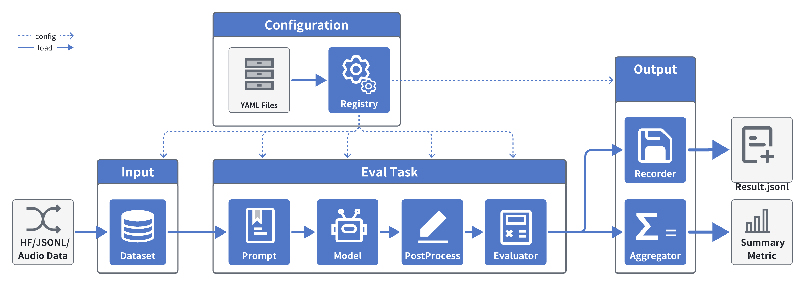

 <h3 align="center">
 A Unified Framework for Comprehensive
Evaluation of Audio Foundation Models
<p>
    <p>
        <a href="README_zh.md">中文</a> | <b>English</b> |
<a href="https://discord.gg/Qrsbft4e" target="_blank">💬discord</a>
 </h3>

# v1.1.0 Highlights
> - **Popular model replication**: Added replication support for popular models, including **replication result showcases** and **one-click replication commands** (see `replication/`).
> - **Isolated inference runtime**: Introduced an isolated inference mechanism. Model-specific dependencies are installed/managed automatically; inference runs in the isolated environment and communicates with the main evaluation process via **IPC**, eliminating dependency conflicts.
> - **Specialized model evaluation support**: Added specialized audio models for **TTS, ASR, and Audio Codec**, further expanding evaluation coverage.

# Table of Contents
- [Table of Contents](#table-of-contents)
- [v1.1.0 Highlights](#v110-highlights)
- [Overview](#overview)
    - [🚀Exceptional Experience with UltraEval-Audio🚀](#exceptional-experience-with-ultraeval-audio)
- [Changelog🔥](#changelog)
- [Leaderboard](#leaderboard)
  - [Audio Understanding Leaderboard](#audio-understanding-leaderboard)
  - [Audio Generation Leaderboard](#audio-generation-leaderboard)
  - [Audio Codec Leaderboard](#audio-codec-leaderboard)
- [Quick Start](#quick-start)
  - [Environment Preparation](#environment-preparation)
  - [Run Examples](#run-examples)
  - [res](#res)
  - [Usage](#usage)
  - [Dataset Selection](#dataset-selection)
    - [Model Selection](#model-selection)
- [Acknowledgement](#acknowledgement)
- [Contact Us](#contact-us)


# Overview

### 🚀Exceptional Experience with UltraEval-Audio🚀

UltraEval-Audio — The world's first open-source framework supporting both speech understanding and speech generation evaluation, specifically designed for large audio models. It aggregates 34 authoritative benchmarks, covering four major domains: speech, sound, medicine, and music, supporting 10 languages and 12 task categories. With UltraEval-Audio, you will experience unprecedented convenience and efficiency:

- **Direct Replication of Popular Models 🔬**: Provides detailed [replication documentation and commands](./replication/), ensuring you can easily reproduce evaluation results of open-source models with complete transparency and reproducibility.
- **One-Click Benchmark Management 📥**: Say goodbye to tedious manual downloading and data processing. UltraEval-Audio automates it all, letting you easily acquire well-known benchmark datasets (e.g., Librispeech, TED-LIUM, Seed-TTS-Eval).
- **Built-in Evaluation Tools ⚙️**: No need to hunt for evaluation tools. UltraEval-Audio binds datasets with commonly used official evaluation methods (e.g., WER, WER-ZH, BLEU, G-Eval) to ensure alignment between datasets and metrics.
- **Powerful and Flexible 🛠️**: Supports preview testing, random sampling, error retries, and resume-from-breakpoint, ensuring a flexible and controllable evaluation process while boosting efficiency and accuracy.
- **Seamless Integration of Custom Datasets 💼**: Supports not only public benchmarks but also powerful custom dataset integration, allowing rapid application in various engineering scenarios.
- **Easy Integration with Existing Systems 🔗**: With excellent extensibility and standardized design, UltraEval-Audio seamlessly connects with your existing evaluation pipelines, simplifying project management and unifying output results.




# Changelog🔥
- [2025/12/26]
  - Add replication docs for popular models: [CosyVoice2](replication/CosyVoice2.md), [CosyVoice3](replication/CosyVoice3.md), [GLM-TTS](replication/GLM-TTS.md), [IndexTTS2](replication/IndexTTS2.md), [VoxCPM](replication/VoxCPM.md)
- [2025/12/04]
  - Support [Qwen3-Omni](replication/qwen3_omni.md), update [Kimi-Audio](replication/kimi-audio.md)
- [2025/12/02]
  - 🌟 **Added [Replication Results and Command Documentation](./replication/)**: To better support the open-source community, we have detailed the evaluation process and results of current open-source models, ensuring the evaluation process is completely transparent and reproducible.
  - Support [Long-TTS-Eval](registry/dataset/long-tts-eval.yaml) dataset, see alignment details in [Long-TTS-Eval](./replication/Long-TTS-Eval.md)
  - Support [MGM-Omni TTS](registry/model/mgm_omni.yaml) model, see alignment details in [MGM-Omni](./replication/MGM-Omni.md)
- [2025/10/30]
  - Support [VoxCPM](https://huggingface.co/openbmb/VoxCPM-0.5B) TTS model: `--model voxcpm-tts` `--model voxcpm-vc`
  - Use `uv` to accelerate model dependency installation 🚀
- [2025/10/17]
  - [Support seed-tts-eval dataset](docs/seed-tts-eval4voice_clone.md)
- [2025/05/22]
  - [Use audio quality metrics](https://github.com/OpenBMB/UltraEval-Audio/blob/main/docs/how%20use%20UTMOS%2C%20DNSMOS%20eval%20speech%20quality.md)
- [2025/05/12]
  - Support Qwen2.5-Omni `qwen2.5-omni-audio, qwen2.5-omni-speech`, Kimi-Audio-7B-Instruct `kimiaudio, kimiaudio-speech` models, and update Audio Understanding Leaderboard
- [2025/05/8]
  - Faster resume evaluation, `-r/--resume` parameter, automatically searches for the latest breakpoint result if no file is specified
  - Support evaluation starting from inference file, `--infer-file` parameter, allows direct evaluation from inference file without regeneration
- [2025/03/23]
  - Added support for step-audio model evaluation and ranking
    - Ranking details: [leaderboard.md](assets/leaderboard.md)
    - Evaluation support: [Step-Audio-Chat](https://github.com/UltraEval/Step-Audio)
- [2025/03/04]
  - Support [resume evaluation](docs/Procedures for Restarting an Incomplete Evaluation.md), command line parameter `--resume $checkpoint_res_file`
  - glm-4-voice service deployment, supports UltraEval-Audio evaluation, see details at [GLM-4-Voice](https://github.com/UltraEval/GLM-4-Voice)
  - Parallel evaluation support, command line parameter `--workers $num_workers`
- [2025/01/13] release v1.0.0


# Leaderboard

## Audio Understanding Leaderboard

> **Audio Understanding Audio Foundation Models**: Speech + Text → Text
>
> WER ($\downarrow$) for ASR, BLEU ($\uparrow$) for AST, and ACC ($\uparrow$) for EMO. Best results are in bold.

| Model | ASR<br>Librispeech<br>dev-clean\|dev-other<br>test-clean\|test-other | ASR<br>TED-LIUM | ASR<br>CV-15<br>en\|zh | ASR<br>Aishell-1 | ASR<br>FLEURS-zh | ASR<br>Wenet<br>-test-net | AST<br>covost2-en2zh | AST<br>covost2-zh2en | EMO<br>MELD |
| :--- | :---: | :---: | :---: | :---: | :---: | :---: | :---: | :---: | :---: |
| **GPT-4o-Realtime** | 2.30\|5.60<br>2.60\|5.50 | 4.80 | 27.44\|37.44 | 7.30 | 5.40 | 28.90 | 37.10 | 15.70 | 33.20 |
| **Gemini-1.5-Pro** | 2.60\|4.40<br>2.90\|4.90 | 3.00 | 8.36\|13.26 | 4.50 | 5.90 | 14.30 | 47.30 | 22.60 | 48.40 |
| **Gemini-1.5-Flash** | 5.90\|7.20<br>21.90\|16.30 | 6.90 | 208.00\|84.37 | 9.00 | 85.90 | 279.90 | 33.40 | 8.20 | 45.20 |
| **Qwen2-Audio<br>-Instruction** | 2.90\|5.50<br>3.10\|5.70 | 5.90 | 10.68\|8.39 | 2.60 | 6.90 | 10.30 | 39.50 | 22.90 | 17.40 |
| **MiniCPM-o 2.6** | 1.60\|3.40<br>1.70\|4.40 | 3.00 | 10.30\|9.60 | 1.60 | 4.40 | 6.90 | **48.20** | 27.20 | 52.40 |
| **Qwen2.5-Omni** | 2.10\|4.20<br>2.40\|4.20 | 4.70 | 8.70\|5.20 | 1.10 | 4.60 | 6.00 | 42.50 | 11.50 | 53.60 |
| **Kimi-Audio-7B-Instruct** | **1.18\|2.34**<br>**1.28\|2.44** | 2.96 | 7.09\|5.72 | **0.60** | **2.53** | 5.55 | 36.61 | 18.30 | **59.23** |
| **Qwen2-Audio** | 1.57\|3.50<br>1.60\|3.88 | 3.43 | 8.67\|7.03 | 1.52 | 5.89 | 8.09 | 45.30 | 24.84 | 42.87 |
| **MiDaShengLM-7B** | 2.20\|4.75<br>2.21\|5.16 | 146.53 | 13.66\|29.13 | 1.23 | 3.28 | 16.56 | 38.52 | 22.68 | 53.96 |
| **Gemini-2.5-Flash** | 3.73\|6.71<br>3.28\|12.03 | 3.53 | 46.76\|36.15 | 6.40 | 6.45 | 126.07 | 3.67 | 10.61 | 51.53 |
| **Qwen3-Omni-30B<br>-A3B-Instruct** | 1.25\|2.27<br>1.36\|2.57 | 2.82 | **6.00**\|**4.32** | 0.87 | 2.61 | **4.82** | 46.58 | **29.40** | 56.81 |
| **Gemini-2.5-Pro** | 5.30\|4.51<br>2.84\|6.74 | **2.52** | 9.42\|11.04 | 3.36 | 4.25 | 16.83 | 41.75 | 27.84 | 46.59 |

## Audio Generation Leaderboard

> **Audio Understanding Audio Foundation Models**: Speech → Speech
> Table: Audio generation performance ($\uparrow$). *Acoustic metrics (UTMOS | DNSMOS P.835 | DNSMOS P.808, scale 1--5) are evaluated on the generated audio responses from the speech tasks. Best results are in bold.

| Models | Speech<br>Web Questions | Speech<br>TriviaQA | Speech<br>CMMLU | SpeechHSK | Speech AlpacaEval | Acoustics* |
| :--- | :---: | :---: | :---: | :---: | :---: | :---: |
| **GPT-4o-Realtime** | **51.60** | **69.70** | 70.05 | **98.69** | **74.00** | 4.29\|3.44\|4.26 |
| **GLM-4-Voice** | 32.00 | 36.40 | 52.61 | 71.06 | 51.00 | 4.21\|3.46\|4.07 |
| **MiniCPM-o 2.6** | 40.00 | 40.20 | 51.37 | 80.68 | 51.00 | 4.12\|3.39\|4.02 |
| **Qwen2.5-Omni** | 38.89 | 39.94 | **73.72** | 95.65 | 54.00 | 4.23\|**3.48**\|**4.27** |
| **Kimi-Audio-7B-Instruct** | 33.69 | 38.20 | 71.25 | 97.42 | 34.40 | 2.94\|3.22\|3.62 |
| **Qwen3-Omni-30B-A3B-Instruct** | 51.50 | 55.27 | 47.83 | 40.27 | 67.97 | **4.44**\|3.45\|4.12 |


## Audio Codec Leaderboard
> **Audio Codec**: Speech → Speech.
> Table: Audio Codec Performance: ASR-WER ($\downarrow$), ASR-CER ($\downarrow$), SIM ($\uparrow$), and Quality (UTMOS\|DNSMOS P.835\|DNSMOS P.808, $\uparrow$). Note: The hyphen (-) indicates that UTMOS is not applicable to Chinese speech (Aishell-1). Best results are in bold.

| Models | Librispeech-dev-clean<br>ASR-WER | Librispeech-dev-clean<br>SIM | Librispeech-dev-clean<br>Quality | Librispeech-test-clean<br>ASR-WER | Librispeech-test-clean<br>SIM | Librispeech-test-clean<br>Quality | Aishell-1<br>ASR-CER | Aishell-1<br>SIM | Aishell-1<br>Quality |
| :--- | :---: | :---: | :---: | :---: | :---: | :---: | :---: | :---: | :---: |
| **Encodec-24k** | 4.56 | 59.40 | 1.58\|3.12\|2.36 | 4.32 | 59.40 | 1.57\|3.12\|2.36 | 13.95 | 47.48 | -\|2.93\|2.03 |
| **Encodec-48k** | 3.85 | 65.53 | 1.52\|2.88\|2.42 | 3.80 | 66.00 | 1.48\|2.87\|2.40 | 6.85 | 68.78 | -\|2.79\|2.21 |
| **Chattts-DVAE** | 7.49 | 34.83 | 1.30\|2.66\|2.11 | 6.75 | 36.21 | 1.29\|2.64\|2.12 | 32.36 | 32.36 | -\|2.24\|1.57 |
| **Mimi (32bit)** | **2.04** | **92.18** | 3.83\|2.87\|2.44 | **1.96** | **92.68** | 3.84\|2.92\|2.49 | **2.82** | **84.80** | -\|2.43\|1.89 |
| **Mimi (8bit)** | 2.76 | 72.15 | 3.52\|2.78\|2.37 | 2.83 | 73.13 | 3.53\|2.83\|2.43 | 6.82 | 60.63 | -\|2.42\|2.04 |
| **Mimi-streaming (8bit)** | 6.76 | 54.02 | 1.65\|2.78\|2.37 | 6.19 | 54.32 | 1.63\|2.83\|2.43 | 19.62 | 40.67 | -\|2.42\|2.04 |
| **WavTokenizer-large-v2-75-tokens** | 4.31 | 69.97 | 4.01\|3.64\|**3.26** | 4.05 | 68.15 | 4.00\|3.63\|**3.27** | 8.97 | 64.27 | -\|3.11\|**2.85** |
| **WavTokenizer-large-40-tokens** | 8.13 | 60.26 | 3.78\|3.70\|3.13 | 7.73 | 56.63 | 3.77\|3.70\|3.16 | 25.52 | 49.21 | -\|3.13\|2.50 |
| **Spark** | 2.39 | 79.94 | **4.18**\|**3.85**\|3.24 | 2.53 | 79.53 | **4.18**\|**3.83**\|3.24 | 3.66 | 74.76 | -\|**3.63**\|**2.85** |


# Quick Start

## Environment Preparation
```shell
git clone https://github.com/OpenBMB/UltraEval-Audio.git
cd UltraEval-Audio
conda create -n env python=3.10 -y
conda activate env
pip install -e .
```
or use `uv` for faster installation:
```shell
uv venv env --python 3.10
source env/bin/activate
uv pip install -e .
```

## Run Examples
```bash
# For some regions, you may need to set: export HF_ENDPOINT=https://hf-mirror.com
# Test MiniCPM-o 2.6 speech understanding capability
CUDA_VISIBLE_DEVICES=0 python audio_evals/main.py --dataset sample --prompt mini-cpm-omni-asr-zh --model MiniCPMo2_6-audio

# Test MiniCPM-o 2.6 speech generation capability
CUDA_VISIBLE_DEVICES=0 python audio_evals/main.py --dataset llama-questions-s2t --model MiniCPMo2_6-speech

# Test GPT-4o-Realtime speech understanding capability
export OPENAI_API_KEY=$your-key
python audio_evals/main.py --dataset sample --model gpt4o_audio

# Test GPT-4o-Realtime speech generation capability
export OPENAI_API_KEY=$your-key
python audio_evals/main.py --dataset llama-questions-s2t --model gpt4o_speech

# Test gemini-1.5-pro speech understanding capability
export GOOGLE_API_KEY=$your-key
python audio_evals/main.py --dataset sample --model gemini-pro


# Test qwen2-audio-offline speech understanding capability
CUDA_VISIBLE_DEVICES=0 python audio_evals/main.py --dataset sample --model qwen2-audio-chat
```
If you encounter errors or cannot reproduce Mini-CPM-o 2.6 results, please check [FAQ](FAQ.md)

## res

Evaluation complete, results are as follows:

```txt
- res
    |-- $model-name
        |-- $dataset
            |-- $time.jsonl
            |-- $time-overview.jsonl
```


## Usage


Evaluation command:

```bash
python audio_evals/main.py --dataset <dataset_name> --model <model_name>
```

## Dataset Selection

`<dataset_name>` specifies the dataset to evaluate. Supported datasets can be viewed via `python cli/list_availabel.py`

Construct your own dataset: [docs/how add a dataset.md](docs%2Fhow%20add%20a%20dataset.md)


### Model Selection

`model_name` specifies the model to evaluate. Supported models can be viewed via `python cli/list_availabel.py`

Evaluate your own model [docs/how eval your model.md](docs%2Fhow%20eval%20your%20model.md)

# Acknowledgement

We referenced the `registry` code in [evals](https://github.com/openai/evals)

# Contact Us
If you have any suggestions or questions, please file an issue or join our discord group: https://discord.com/invite/Qrsbft4e
