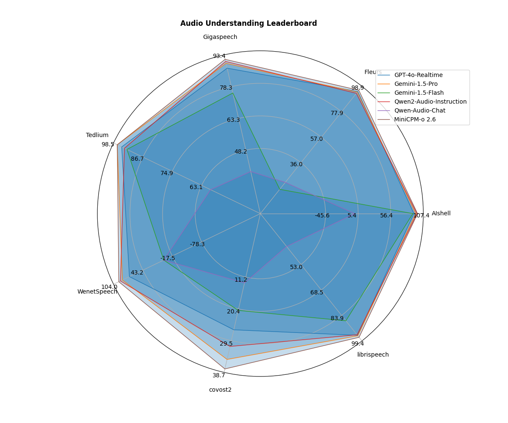
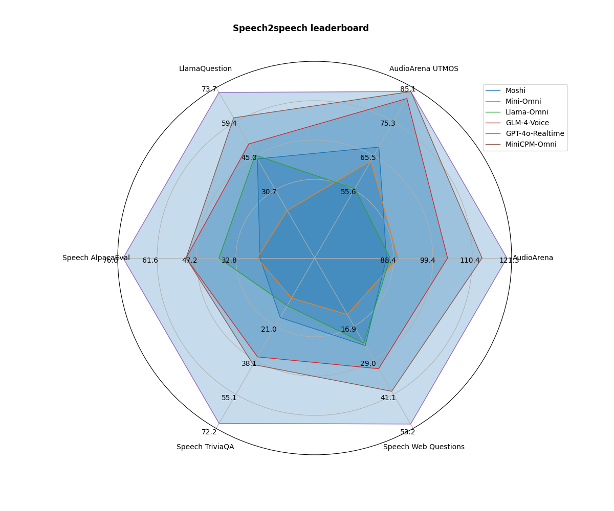
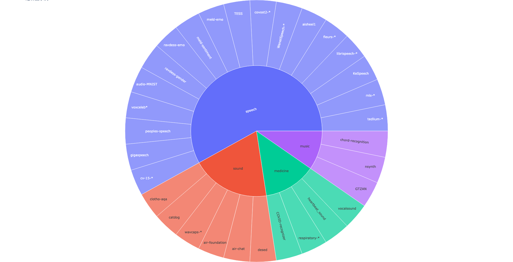
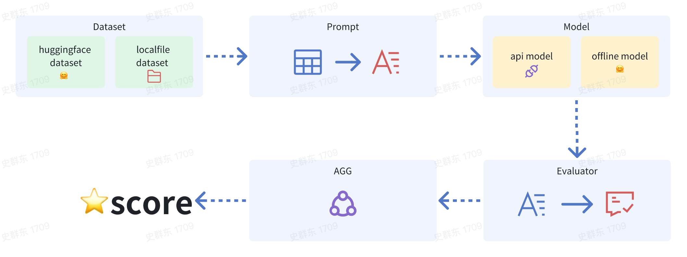

 <h4 align="center">
    <p>
        <b>中文</b> | <a href="https://github.com/OpenBMB/UltraEval-Audio/blob/main/README_en.md">English</a> |
<a href="https://discord.gg/jKYuDc2M" target="_blank">💬discord</a>
 </h4>


# Overview

### 🚀超凡体验，尽在UltraEval-Audio🚀

UltraEval-Audio——全球首个同时支持语音理解和语音生成评估的开源框架，专为语音大模型评估打造，集合了34项权威Benchmark，覆盖语音、声音、医疗及音乐四大领域，支持十种语言，涵盖十二类任务。选择UltraEval-Audio，您将体验到前所未有的便捷与高效：

- **一键式基准管理 📥**：告别繁琐的手动下载与数据处理，UltraEval-Audio为您自动化完成这一切，轻松获取所需基准测试数据。
- **内置评估利器 ⚙️**：无需再四处搜寻评估工具，UltraEval-Audio内置八种常用的评估方法（如WER、WER-ZH、BLEU、G-Eval），无论是基于规则还是模型驱动，都能满足您的需求。
- **功能强大，灵活易用 🛠️**：支持预览测试、随机样本、错误重试、断点重跑等功能，确保评估过程灵活可控，提升效率与准确性。
- **无缝集成自定义数据集 💼**：不仅支持公开benchmark，还提供强大的自定义数据集功能，让您在各种工程场景下也能迅速应用。
- **轻松对接现有系统 🔗**：具备优秀的扩展性和标准化设计，即使您已拥有一套完善的评估体系，UltraEval-Audio也能无缝对接，简化项目管理流程，输出结果统一规范。

# Leaderboard

> **Audio Understanding LLM**: Speech + Text → Text
>
> **Audio Generation LLM**: Speech → Speech

<div style="display: flex;">
  <div style="flex: 1; margin-right: 10px;">

## Audio Understanding LLM Leaderboard


| Rank | Model                   | ASR | AST |
|------|-------------------------|-----|-----|
| 🏅   | MiniCPM-o 2.6           | 96  | 38  |
| 🥈   | Gemini-1.5-Pro          | 94  | 35  |
| 🥉   | qwen2-audio-instruction | 94  | 31  |
| 4    | GPT-4o-Realtime         | 92  | 26  |
| 5    | Gemini-1.5-Flash        | 49  | 21  |
| 6    | Qwen-Audio-Chat         | 3   | 12  |

  </div>
  <div style="flex: 1;">

## Audio Generation LLM Leaderboard

| Rank | Model           | Semantic | Acoustic | AudioArena |
|------|-----------------|----------|----------|------------|
| 🏅   | GPT-4o-Realtime | 67       | 84       | 1200       |
| 🥈   | MiniCPM-o 2.6   | 48       | 80       | 1131       |
| 🥉   | GLM-4-Voice     | 42       | 82       | 1035       |
| 4    | Mini-Omni       | 16       | 64       | 897        |
| 5    | Llama-Omni      | 29       | 54       | 875        |
| 6    | Moshi           | 27       | 68       | 865        |


</div>
</div>

> 详细模型指标见[leaderboard.md](assets/leaderboard.md)


<table>
<tr>
<td></td>
<td></td>
</tr>
</table>

    # 支持数据集


# 更新日志🔥
- [2025/03/04]
  - 支持断点[续评] [resume evaluation](docs/Procedures for Restarting an Incomplete Evaluation.md), 命令行参数 `--resume $checkpoint_res_file`
  - glm-4-voice服务部署，支持UltraEval-Audio评测, 详情见[GLM-4-Voice](https://github.com/UltraEval/GLM-4-Voice)
  - 并行评测支持，命令行参数 `--workers $num_workers`
- [2025/01/13] release v1.0.0


# 快速上手

## 环境准备
```shell
git clone https://github.com/OpenBMB/UltraEval-Audio.git
cd UltraEval-Audio
conda create -n aduioeval python=3.10 -y
conda activate aduioeval
pip install -r requirments.txt
```

## 运行示例
```bash
export PYTHONPATH=$PWD:$PYTHONPATH

# 针对部分地区可能需要加速下载 需要设置：export HF_ENDPOINT=https://hf-mirror.com
# 测试MiniCPM-o 2.6语音理解能力
pip install -r requirments/minicpm_o2_6.txt
CUDA_VISIBLE_DEVICES=0 python audio_evals/main.py --dataset sample --prompt mini-cpm-omni-asr-zh --model MiniCPMo2_6-audio

# 测试MiniCPM-o 2.6语音生成能力
CUDA_VISIBLE_DEVICES=0 python audio_evals/main.py --dataset llama-questions-s2t --model MiniCPMo2_6-speech

# 测试GPT-4o-Realtime语音理解能力
export OPENAI_API_KEY=$your-key
python audio_evals/main.py --dataset sample --model gpt4o_audio

# 测试GPT-4o-Realtime语音生成能力
export OPENAI_API_KEY=$your-key
python audio_evals/main.py --dataset llama-questions-s2t --model gpt4o_speech

# 测试gemini-1.5-pro语音理解能力
export GOOGLE_API_KEY=$your-key
python audio_evals/main.py --dataset sample --model gemini-pro


# 测试qwen2-audio-offline语音理解能力
pip install -r requirments-offline-model.txt
CUDA_VISIBLE_DEVICES=0 python audio_evals/main.py --dataset sample --model qwen2-audio-chat
```
遇到报错可以先看[常见问题](FAQ.md)

## res

评测完毕，结果文件如下:

```txt
- res
    |-- $model-name
        |-- $dataset
            |-- $time.jsonl
            |-- $time-overview.jsonl
```


## Usage



评测命令:

```bash
python audio_evals/main.py --dataset <dataset_name> --model <model_name>
```

## 数据集选择

`--dataset` 指定要评测的数据集，支持的数据集如下:

- `speech-chatbot-alpaca-eval`
- `llama-questions`
- `speech-web-questions`
- `speech-triviaqa`
- `tedlium-release1`
- `tedlium-release2`
- `tedlium-release3`
- `catdog`
- `audiocaps`
- `covost2-en-ar`
- `covost2-en-ca`
- `covost2-en-cy`
- `covost2-en-de`
- `covost2-en-et`
- `covost2-en-fa`
- `covost2-en-id`
- `covost2-en-ja`
- `covost2-en-lv`
- `covost2-en-mn`
- `covost2-en-sl`
- `covost2-en-sv`
- `covost2-en-ta`
- `covost2-en-tr`
- `covost2-en-zh`
- `covost2-zh-en`
- `covost2-it-en`
- `covost2-fr-en`
- `covost2-es-en`
- `covost2-de-en`
- `GTZAN`
- `TESS`
- `nsynth`
- `meld-emo`
- `meld-sentiment`
- `clotho-aqa`
- `ravdess-emo`
- `ravdess-gender`
- `COVID-recognizer`
- `respiratory-crackles`
- `respiratory-wheezes`
- `KeSpeech`
- `audio-MNIST`
- `librispeech-test-clean`
- `librispeech-dev-clean`
- `librispeech-test-other`
- `librispeech-dev-other`
- `mls_dutch`
- `mls_french`
- `mls_german`
- `mls_italian`
- `mls_polish`
- `mls_portuguese`
- `mls_spanish`
- `heartbeat_sound`
- `vocalsound`
- `fleurs-zh`
- `voxceleb1`
- `voxceleb2`
- `chord-recognition`
- `wavcaps-audioset`
- `wavcaps-freesound`
- `wavcaps-soundbible`
- `air-foundation`
- `air-chat`
- `desed`
- `peoples-speech`
- `WenetSpeech-test-meeting`
- `WenetSpeech-test-net`
- `gigaspeech`
- `aishell-1`
- `cv-15-en`
- `cv-15-zh`
- `cv-15-fr`
- `cv-15-yue`


### 数据集详细说明
| <dataset_name>             | name                       | task                              | domain             | metric     |
|----------------------------|----------------------------|-----------------------------------|--------------------|------------|
| speech-chatbot-alpaca-eval | speech-chatbot-alpaca-eval | SpeechQA                          | speech2speech      | GPT-score  |
| llama-questions            | llama-questions            | SpeechQA                          | speech2speech      | acc        |
| speech-web-questions       | speech-web-questions       | SpeechQA                          | speech2speech      | acc        |
| speech-triviaqa            | speech-triviaqa            | SpeechQA                          | speech2speech      | acc        |
| tedlium-*                  | tedlium                    | ASR(Automatic Speech Recognition) | speech             | wer        |
| clotho-aqa                 | ClothoAQA                  | AQA(AudioQA)                      | sound              | acc        |
| catdog                     | catdog                     | AQA                               | sound              | acc        |
| mls-*                      | multilingual_librispeech   | ASR                               | speech             | wer        |
| KeSpeech                   | KeSpeech                   | ASR                               | speech             | cer        |
| librispeech-*              | librispeech                | ASR                               | speech             | wer        |
| fleurs-*                   | FLEURS                     | ASR                               | speech             | wer        |
| aisheel1                   | AISHELL-1                  | ASR                               | speech             | wer        |
| WenetSpeech-*              | WenetSpeech                | ASR                               | speech             | wer        |
| covost2-*                  | covost2                    | STT(Speech Text Translation)      | speech             | BLEU       |
| GTZAN                      | GTZAN                      | MQA(MusicQA)                      | music              | acc        |
| TESS                       | TESS                       | EMO(emotional recognition)        | speech             | acc        |
| nsynth                     | nsynth                     | MQA                               | music              | acc        |
| meld-emo                   | meld                       | EMO                               | speech             | acc        |
| meld-sentiment             | meld                       | SEN(sentiment recognition)        | speech             | acc        |
| ravdess-emo                | ravdess                    | EMO                               | speech             | acc        |
| ravdess-gender             | ravdess                    | GEND(gender recognition)          | speech             | acc        |
| COVID-recognizer           | COVID                      | MedicineCls                       | medicine           | acc        |
| respiratory-*              | respiratory                | MedicineCls                       | medicine           | acc        |
| audio-MNIST                | audio-MNIST                | AQA                               | speech             | acc        |
| heartbeat_sound            | heartbeat                  | MedicineCls                       | medicine           | acc        |
| vocalsound                 | vocalsound                 | MedicineCls                       | medicine           | acc        |
| voxceleb*                  | voxceleb                   | GEND                              | speech             | acc        |
| chord-recognition          | chord                      | MQA                               | music              | acc        |
| wavcaps-*                  | wavcaps                    | AC(AudioCaption)                  | sound              | acc        |
| air-foundation             | AIR-BENCH                  | AC,GEND,MQA,EMO                   | sound,music,speech | acc        |
| air-chat                   | AIR-BENCH                  | AC,GEND,MQA,EMO                   | sound,music,speech | GPT4-score |
| desed                      | desed                      | AQA                               | sound              | acc        |
| peoples-speech             | peoples-speech             | ASR                               | speech             | wer        |
| gigaspeech                 | gigaspeech                 | ASR                               | speech             | wer        |
| cv-15-*                    | common voice 15            | ASR                               | speech             | wer        |

构造你自己的数据集: [docs/how add a dataset.md](docs%2Fhow%20add%20a%20dataset.md)


### 模型选择

`--model` 指定要评测的模型，支持的模型如下:

- **`gpt4o_audio`**：使用 `gpt-4o-realtime-preview-2024-10-01` 的音频转文本模态模型。
- **`gpt4o_speech`**：使用 `gpt-4o-realtime-preview-2024-10-01` 的音频转语音模态模型。
- **`gpt4o_audio_ms`**：使用 `gpt-4o-realtime-preview-2024-10-01`（在 AZURE 上）的音频转文本模态模型。
- **`gpt4o_speech_ms`**：使用 `gpt-4o-realtime-preview-2024-10-01`（在 AZURE 上）的音频转语音模态模型。
- **`gpt4o_speech`**：使用 `Ggpt-4o-realtime-preview-2024-10-01` 的音频转语音模态模型。
- **`gemini-pro`**：使用 `Gemini Pro` 模型。
- **`gemini-1.5-pro`**：使用 `Gemini 1.5 Pro` 模型。
- **`gemini-1.5-flash`**：使用 `Gemini 1.5 Flash` 模型。
- **`gemini-2.0-flash-exp`**：使用 `Gemini 2.0 Flash` 模型。
- **`qwen-audio`**：使用 `qwen-audio-chat`  API 模型。
- **`qwen2-audio-offline`**：使用 `Qwen2-Audio-7B` 离线模型。
- **`qwen2-audio-chat`**：使用 `Qwen2-Audio-7B-Instruct` 离线模型。
- **`qwen-audio-chat-offline`**：使用 `Qwen-Audio-Chat` 离线模型。
- **`qwen-audio-pretrain-offline`**：使用 `Qwen-Audio` 离线模型。
- **`ultravox`**：使用 `ultravox-v0_4` 离线模型。

> speech2speech 模型(glm4voice,mini-omni...)稍后支持。


评测你自己的模型 [docs/how eval your model.md](docs%2Fhow%20eval%20your%20model.md)

# 致谢

我们参考了[evals](https://github.com/openai/evals) 中`registry`代码

# 联系我们
如果你有任何建议或疑问可以提issue或者加入discord群组: https://discord.gg/PHGy66QP
