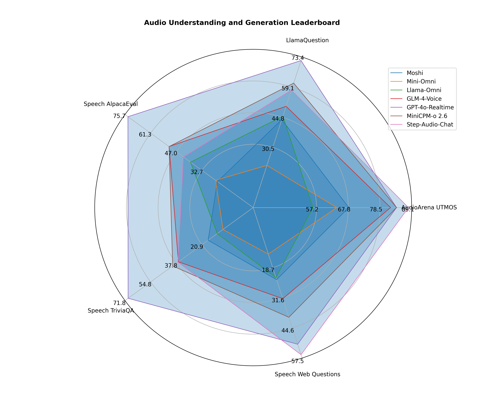

 <h4 align="center">
    <p>
        <a href="https://github.com/OpenBMB/UltraEval-Audio/blob/main/README.md">中文</a> |
    <b>English</b> |
<a href="https://discord.gg/PHGy66QP" target="_blank">💬discord</a>
 </h4>


# Overview


### 🚀 Exceptional Experience with UltraEval-Audio 🚀

UltraEval-Audio -- the world's first open-source framework that simultaneously supports both **speech understanding and speech generation** evaluation, specifically designed for assessing large audio models. It integrates 34 authoritative benchmarks, covering four major fields: speech, sound, healthcare, and music, supporting ten languages and twelve types of tasks. With UltraEval-Audio, you will experience unprecedented convenience and efficiency:

- **One-Click Benchmark Management 📥**: Say goodbye to tedious manual downloads and data processing. UltraEval-Audio automates all of this, allowing you to easily access the benchmark test data you need.
- **Built-In Evaluation Tools ⚙️**: No need to search for evaluation tools elsewhere. UltraEval-Audio comes equipped with eight commonly used evaluation methods (e.g., WER, WER-ZH, BLEU, G-Eval), meeting your needs whether they are rule-based or model-driven.
- **Powerful and User-Friendly 🛠️**: Supports preview testing, random sampling, error retries, and checkpoint resuming, ensuring a flexible and controllable evaluation process while improving efficiency and accuracy.
- **Seamless Custom Dataset Integration 💼**: Not only does it support public benchmarks, but it also provides robust custom dataset functionality, enabling quick application in various engineering scenarios.
- **Easy Integration with Existing Systems 🔗**: With excellent scalability and standardized design, UltraEval-Audio can seamlessly integrate even if you already have a well-established evaluation system, simplifying project management and delivering unified, standardized results.

# Leaderboard

> **Audio Understanding LLM**: Speech + Text → Text
>
> **Audio Generation LLM**: Speech → Speech

<div style="display: flex;">
  <div style="flex: 1; margin-right: 10px;">

## Audio Understanding LLM Leaderboard


| Rank | Model                   | ASR | AST |
|------|-------------------------|-----|-----|
| 🏅   | MiniCPM-o 2.6           | 96  | 38  |
| 🥈   | Gemini-1.5-Pro          | 94  | 35  |
| 🥉   | qwen2-audio-instruction | 94  | 31  |
| 4    | GPT-4o-Realtime         | 92  | 26  |
| 5    | Gemini-1.5-Flash        | 49  | 21  |
| 6    | Qwen-Audio-Chat         | 3   | 12  |

  </div>
  <div style="flex: 1;">

## Audio Generation LLM Leaderboard

| Rank | Model           | Semantic | Acoustic | AudioArena |
|------|-----------------|----------|----------|------------|
| 🏅   | GPT-4o-Realtime | 67       | 84       | 1200       |
| 🥈   | MiniCPM-o 2.6   | 48       | 80       | 1131       |
| 🥉   | GLM-4-Voice     | 42       | 82       | 1035       |
| 4    | Mini-Omni       | 16       | 64       | 897        |
| 5    | Llama-Omni      | 29       | 54       | 875        |
| 6    | Moshi           | 27       | 68       | 865        |


</div>
</div>


<table>
<tr>
<td></td>
<td></td>
</tr>
</table>

# Support datasets


# Changelog🔥
- [2025/01/13] release v1.0.0


# Quick Start

## ready env
```shell
git clone https://github.com/OpenBMB/UltraEval-Audio.git
cd UltraEval-Audio
conda create -n aduioeval python=3.10 -y
conda activate aduioeval
pip install -r requirments.txt
```

## run
```bash
export PYTHONPATH=$PWD:$PYTHONPATH

# eval gpt-4o-realtime text modal model
export OPENAI_API_KEY=$your-key
python audio_evals/main.py --dataset catdog --model gpt4o_audio

# eval gpt-4o-realtime audio modal model
export OPENAI_API_KEY=$your-key
python audio_evals/main.py --dataset llama-questions --model gpt4o_speech

# you can use gpt-4o-realtime in AZURE
export AZURE_OPENAI_URL=$your-key
export AZURE_OPENAI_API_KEY=$your-key
python audio_evals/main.py --dataset catdog --model gpt4o_speech


# eval gemini model
export GOOGLE_API_KEY=$your-key
python audio_evals/main.py --dataset catdog --model gemini-pro


# eval qwen2-audio  offline model in local
pip install -r requirments-offline-model.txt
python audio_evals/main.py --dataset KeSpeech-sample --model qwen2-audio-chat

```

## res

After program executed, you will get the performance in console and detail result as below:

```txt
- res
    |-- $time-$name-$dataset.jsonl
```


## Usage


To run the evaluation script, use the following command:

```bash
python audio_evals/main.py --dataset <dataset_name> --model <model_name>
```

## Dataset Options

The `--dataset` parameter allows you to specify which dataset to use for evaluation. The following options are available:

- `speech-chatbot-alpaca-eval`
- `llama-questions`
- `speech-web-questions`
- `speech-triviaqa`
- `tedlium-release1`
- `tedlium-release2`
- `tedlium-release3`
- `catdog`
- `audiocaps`
- `covost2-en-ar`
- `covost2-en-ca`
- `covost2-en-cy`
- `covost2-en-de`
- `covost2-en-et`
- `covost2-en-fa`
- `covost2-en-id`
- `covost2-en-ja`
- `covost2-en-lv`
- `covost2-en-mn`
- `covost2-en-sl`
- `covost2-en-sv`
- `covost2-en-ta`
- `covost2-en-tr`
- `covost2-en-zh`
- `covost2-zh-en`
- `covost2-it-en`
- `covost2-fr-en`
- `covost2-es-en`
- `covost2-de-en`
- `GTZAN`
- `TESS`
- `nsynth`
- `meld-emo`
- `meld-sentiment`
- `clotho-aqa`
- `ravdess-emo`
- `ravdess-gender`
- `COVID-recognizer`
- `respiratory-crackles`
- `respiratory-wheezes`
- `KeSpeech`
- `audio-MNIST`
- `librispeech-test-clean`
- `librispeech-dev-clean`
- `librispeech-test-other`
- `librispeech-dev-other`
- `mls_dutch`
- `mls_french`
- `mls_german`
- `mls_italian`
- `mls_polish`
- `mls_portuguese`
- `mls_spanish`
- `heartbeat_sound`
- `vocalsound`
- `fleurs-zh`
- `voxceleb1`
- `voxceleb2`
- `chord-recognition`
- `wavcaps-audioset`
- `wavcaps-freesound`
- `wavcaps-soundbible`
- `air-foundation`
- `air-chat`
- `desed`
- `peoples-speech`
- `WenetSpeech-test-meeting`
- `WenetSpeech-test-net`
- `gigaspeech`
- `aishell-1`
- `cv-15-en`
- `cv-15-zh`
- `cv-15-fr`
- `cv-15-yue`


### support dataset detail
| <dataset_name>    | name                     | task                              | domain             | metric     |
|-------------------|--------------------------|-----------------------------------|--------------------|------------|
| tedlium-*         | tedlium                  | ASR(Automatic Speech Recognition) | speech             | wer        |
| clotho-aqa        | ClothoAQA                | AQA(AudioQA)                      | sound              | acc        |
| catdog            | catdog                   | AQA                               | sound              | acc        |
| mls-*             | multilingual_librispeech | ASR                               | speech             | wer        |
| KeSpeech          | KeSpeech                 | ASR                               | speech             | cer        |
| librispeech-*     | librispeech              | ASR                               | speech             | wer        |
| fleurs-*          | FLEURS                   | ASR                               | speech             | wer        |
| aisheel1          | AISHELL-1                | ASR                               | speech             | wer        |
| WenetSpeech-*     | WenetSpeech              | ASR                               | speech             | wer        |
| covost2-*         | covost2                  | STT(Speech Text Translation)      | speech             | BLEU       |
| GTZAN             | GTZAN                    | MQA(MusicQA)                      | music              | acc        |
| TESS              | TESS                     | EMO(emotional recognition)        | speech             | acc        |
| nsynth            | nsynth                   | MQA                               | music              | acc        |
| meld-emo          | meld                     | EMO                               | speech             | acc        |
| meld-sentiment    | meld                     | SEN(sentiment recognition)        | speech             | acc        |
| ravdess-emo       | ravdess                  | EMO                               | speech             | acc        |
| ravdess-gender    | ravdess                  | GEND(gender recognition)          | speech             | acc        |
| COVID-recognizer  | COVID                    | MedicineCls                       | medicine           | acc        |
| respiratory-*     | respiratory              | MedicineCls                       | medicine           | acc        |
| audio-MNIST       | audio-MNIST              | AQA                               | speech             | acc        |
| heartbeat_sound   | heartbeat                | MedicineCls                       | medicine           | acc        |
| vocalsound        | vocalsound               | MedicineCls                       | medicine           | acc        |
| voxceleb*         | voxceleb                 | GEND                              | speech             | acc        |
| chord-recognition | chord                    | MQA                               | music              | acc        |
| wavcaps-*         | wavcaps                  | AC(AudioCaption)                  | sound              | acc        |
| air-foundation    | AIR-BENCH                | AC,GEND,MQA,EMO                   | sound,music,speech | acc        |
| air-chat          | AIR-BENCH                | AC,GEND,MQA,EMO                   | sound,music,speech | GPT4-score |
| desed             | desed                    | AQA                               | sound              | acc        |
| peoples-speech    | peoples-speech           | ASR                               | speech             | wer        |
| gigaspeech        | gigaspeech               | ASR                               | speech             | wer        |
| cv-15-*           | common voice 15          | ASR                               | speech             | wer        |

eval your dataset: [docs/how add a dataset.md](docs%2Fhow%20add%20a%20dataset.md)


### Model Options

The `--model` parameter allows you to specify which model to use for evaluation. The following options are available:

- `qwen2-audio`: Use the Qwen2 Audio model.
- `gemini-pro`: Use the Gemini 1.5 Pro model.
- `gemini-1.5-flash`: Use the Gemini 1.5 Flash model.
- `qwen-audio`: Use the qwen2-audio-instruct Audio API model.

eval your model: [docs/how eval your model.md](docs%2Fhow%20eval%20your%20model.md)

# Contact us
If you have any questions, suggestions, or feature requests related to AudioEvals, we encourage you to submit GitHub Issues to help us collaboratively build an open and transparent UltraEval evaluation community. Alternatively, you can join our Discord group: https://discord.gg/PHGy66QP.


# Citation
