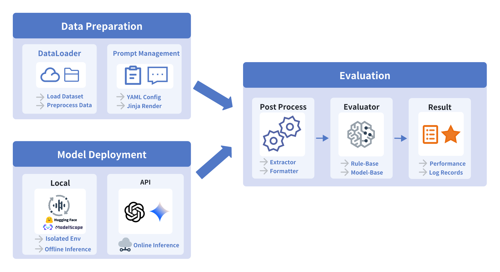

<h4 align="center">
 A Unified Framework for Comprehensive
Evaluation of Audio Foundation Models
<p>
<p>
        <b>中文</b> | <a href="README.md">English</a> |
<a href="https://discord.gg/Qrsbft4e" target="_blank">💬Discord</a>|
<a href="assets/UltraEval_Audio__A_Unified_Framework_for_Comprehensive_Evaluation_of_Audio_Large_Language_Models.pdf">UltraEval-Audio Paper</a>
 </h4>

# v1.1.0 亮点

> - **热门模型复现**：新增热门模型的复现支持，提供**复现结果展示**与**一键复现命令**（文档见 `replication/`）。
> - **Isolated Runtime 推理运行机制**：引入隔离推理架构，自动安装/管理模型的专有依赖环境；推理进程在隔离环境中运行，并通过 **IPC** 与评测主进程交互，彻底消除依赖冲突。
> - **专有模型评测支持**：增加 **TTS、ASR、Audio Codec** 专有音频模型，进一步扩大评测覆盖面。

# 概览

### 🚀超凡体验，尽在UltraEval-Audio🚀

UltraEval-Audio——全球首个同时支持语音理解和语音生成评估的开源框架，专为语音大模型评估打造，集合了34项权威Benchmark，覆盖语音、声音、医疗及音乐四大领域，支持十种语言，涵盖十二类任务。选择UltraEval-Audio，您将体验到前所未有的便捷与高效：

- **直接复现热门模型效果 🔬**：提供详细的[复现文档与命令](./replication/)，确保您能够轻松复现开源模型的评测结果，评测过程完全透明且可复现。
- **一键式基准管理 📥**：告别繁琐的手动下载与数据处理，UltraEval-Audio为您自动化完成这一切，轻松获取知名基准测试数据（如Librispeech、TED-LIUM、Seed-TTS-Eval等）。
- **内置评估利器 ⚙️**：无需再四处搜寻评估工具，UltraEval-Audio直接绑定数据集与常用的官方评估方法（如WER、WER-ZH、BLEU、G-Eval），保证与方法的对齐。
- **功能强大，灵活易用 🛠️**：支持预览测试、随机样本、错误重试、断点重跑等功能，确保评估过程灵活可控，提升效率与准确性。
- **无缝集成自定义数据集 💼**：不仅支持公开benchmark，还提供强大的自定义数据集功能，让您在各种工程场景下也能迅速应用。
- **轻松对接现有系统 🔗**：具备优秀的扩展性和标准化设计，即使您已拥有一套完善的评估体系，UltraEval-Audio也能无缝对接，简化项目管理流程，输出结果统一规范。



# 更新日志🔥
- [2025/12/31]
  - release v1.1.0 🎉🎉🎉
    - 新增热门模型复现文档： [CosyVoice2](replication/CosyVoice2.md), [CosyVoice3](replication/CosyVoice3.md), [GLM-TTS](replication/GLM-TTS.md), [IndexTTS2](replication/IndexTTS2.md), [VoxCPM](replication/VoxCPM.md)
    - 支持Isolated Runtime机制
    - 支持TTS、ASR、Audio Codec专有音频模型更新
- [2025/12/04]
  - 支持[Qwen3-Omni](replication/qwen3_omni.md), 更新[Kimi-Audio](replication/kimi-audio.md)
- [2025/12/02]
  - 🌟 **新增[复现结果与命令文档](./replication/)**：为了更好地支持开源社区，我们详细记录了当前开源模型的评测过程与结果，确保评测过程完全透明且可复现
  - 支持[Long-TTS-Eval](registry/dataset/long-tts-eval.yaml)数据集，对齐详情请见[Long-TTS-Eval](./replication/Long-TTS-Eval.md)
  - 支持[MGM-Omni TTS](registry/model/mgm_omni.yaml)模型，对齐详情请见[MGM-Omni](./replication/MGM-Omni.md)
- [2025/10/30]
  - 支持[VoxCPM](https://huggingface.co/openbmb/VoxCPM-0.5B) TTS模型: `--model voxcpm-tts` `--model voxcpm-vc`
  - 使用uv加速模型安装依赖🚀
- [2025/10/17]
  - [支持seed-tts-eval数据集](docs/seed-tts-eval4voice_clone.md)
- [2025/05/22]
  - [使用音频质量指标](https://github.com/OpenBMB/UltraEval-Audio/blob/main/docs/how%20use%20UTMOS%2C%20DNSMOS%20eval%20speech%20quality.md)
- [2025/05/12]
  - 支持Qwen2.5-Omni `qwen2.5-omni-audio, qwen2.5-omni-speech`, Kimi-Audio-7B-Instruct `kimiaudio, kimiaudio-speech`模型，并且更新音频理解榜单
- [2025/05/8]
  - 更加快捷断点续评, -r/--resume参数，不指定文件可以自动搜索最近一次的断点续评结果
  - 支持从推理文件开始评测, --infer-file参数，可以直接从推理文件开始评测，无需重新生成推理文件
- [2025/03/23]
  - 新增支持step-audio模型评测和排名
    - 排名详情见：[leaderboard.md](assets/leaderboard.md)
    - 评测支持：[Step-Audio-Chat](https://github.com/UltraEval/Step-Audio)
- [2025/03/04]
  - 支持断点[续评] [resume evaluation](docs/Procedures for Restarting an Incomplete Evaluation.md), 命令行参数 `--resume $checkpoint_res_file`
  - glm-4-voice服务部署，支持UltraEval-Audio评测, 详情见[GLM-4-Voice](https://github.com/UltraEval/GLM-4-Voice)
  - 并行评测支持，命令行参数 `--workers $num_workers`
- [2025/01/13] release v1.0.0

# 榜单

## 音频理解榜单

> **音频理解大模型:** 语音 + 文本 → 文本
>
> ASR 使用 WER/CER（$\downarrow$），AST 使用 BLEU（$\uparrow$），EMO 使用 ACC（$\uparrow$）。最佳结果已加粗显示。
>
> **Scoring**:
>
> - **Avg. Score ($\uparrow$)**：所有可用且已归一化的指标分数的平均值。对于基于 WER/CER 的指标，我们使用 \((100-\text{WER/CER})\)；对于其他指标（如 BLEU/Acc.），保持原始数值不变。

| Model                                 | ASR <br>Librispeech <br>dev-clean\|dev-other <br>test-clean\|test-other | ASR <br>TED-LIUM | ASR <br>CV-15 <br>en\|zh | ASR <br>Aishell-1 | ASR <br>FLEURS | ASR <br>Wenet <br>-test-net | AST <br>covost2-en2zh | AST <br>covost2-zh2en | EMO <br>MELD | Avg. Score <br>($\uparrow$) |
| :------------------------------------ | :-------------------------------------------------------------------------------------------------------------------------------------------------------: | :------------------: | :------------------------------: | :-------------------: | :----------------: | :---------------------------------: | :-----------------------: | :-----------------------: | :--------------: | :-------------------------------: |
| **GPT-4o-Realtime**             |                                                               2.30\|5.60 <br>2.60\|5.50                                                               |         4.80         |           27.44\|37.44           |         7.30         |        5.40        |                28.90                |           37.10           |           15.70           |      33.20      |               73.75               |
| **Qwen3-Omni-30B-A3B-Instruct** |                                                               1.25\|2.27 <br>1.36\|2.57                                                               |         2.82         |  **6.00**\|**4.32**  |         0.87         |        2.61        |           **4.82**           |           46.58           |      **29.40**      |      56.81      |          **84.92**          |
| **Qwen2.5-Omni**                |                                                               2.10\|4.20 <br>2.40\|4.20                                                               |         4.70         |            8.70\|5.20            |         1.10         |        4.60        |                6.00                |           42.50           |           11.50           |      53.60      |               81.88               |
| **MiniCPM-o 2.6**               |                                                               1.60\|3.40 <br>1.70\|4.40                                                               |         3.00         |           10.30\|9.60           |         1.60         |        4.40        |                6.90                |      **48.20**      |           27.20           |      52.40      |               83.15               |
| **Kimi-Audio-7B-Instruct**      |                                                     **1.18\|2.34** <br>**1.28\|2.44**                                                     |         2.96         |            7.09\|5.72            |    **0.60**    |   **2.53**   |                5.55                |           36.61           |           18.30           | **59.23** |               83.27               |
| **Gemini-1.5-Flash**            |                                                              5.90\|7.20 <br>21.90\|16.30                                                              |         6.90         |          208.00\|84.37          |         9.00         |       85.90       |               279.90               |           33.40           |           8.20           |      45.20      |               27.80               |
| **Gemini-1.5-Pro**              |                                                               2.60\|4.40 <br>2.90\|4.90                                                               |         3.00         |           8.36\|13.26           |         4.50         |        5.90        |                14.30                |           47.30           |           22.60           |      48.40      |               81.09               |
| **Gemini-2.5-Flash**            |                                                              3.73\|6.71 <br>3.28\|12.03                                                              |         3.53         |           46.76\|36.15           |         6.40         |        6.45        |               126.07               |           3.67           |           10.61           |      51.53      |               62.67               |
| **Gemini-2.5-Pro**              |                                                               5.30\|4.51 <br>2.84\|6.74                                                               |    **2.52**    |           9.42\|11.04           |         3.36         |        4.25        |                16.83                |           41.75           |           27.84           |      46.59      |               80.72               |
| **Qwen2-Audio-7B**              |                                                               1.57\|3.50 <br>1.60\|3.88                                                               |         3.43         |            8.67\|7.03            |         1.52         |        5.89        |                8.09                |           45.30           |           24.84           |      42.87      |               82.14               |
| **Qwen2-Audio-7B-Instruct**     |                                                               2.90\|5.50 <br>3.10\|5.70                                                               |         5.90         |           10.68\|8.39           |         2.60         |        6.90        |                10.30                |           39.50           |           22.90           |      17.40      |               78.29               |
| **MiDaShengLM-7B**              |                                                               2.20\|4.75 <br>2.21\|5.16                                                               |        146.53        |           13.66\|29.13           |         1.23         |        3.28        |                16.56                |           38.52           |           22.68           |      53.96      |               68.50               |

## 音频生成榜单

> **音频生成大模型**: Speech → Speech
> 表：音频生成性能（$\uparrow$）。声学指标（UTMOS | DNSMOS P.835 | DNSMOS P.808，分数范围为 0 到 5）在语音任务生成的音频回复上进行评测。最佳结果已加粗显示。
>
> 注：平均分由 6 个分数取平均得到：5 个语音任务分数 + 归一化后的声学分数。对于声学分数（UTMOS | DNSMOS P.835 | DNSMOS P.808），每个数值（0--5）先乘以 20 映射到 0--100，再取平均得到归一化声学分数。

| Models                                | Speech <br>WebQuestions | Speech <br>TriviaQA | Speech <br>AlpacaEval | Speech <br>CMMLU | Speech <br>HSK |              Acoustics              | Avg. Score <br>($\uparrow$) |
| :------------------------------------ | :-------------------------: | :---------------------: | :-----------------------: | :------------------: | :----------------: | :----------------------------------: | :-------------------------------: |
| **GPT-4o-Realtime**             |       **51.60**       |     **69.70**     |      **74.00**      |        70.05        |  **98.69**  |           4.29\|3.44\|4.26           |          **74.00**          |
| **Qwen3-Omni-30B-A3B-Instruct** |            51.50            |          55.27          |           67.97           |        47.83        |       40.27       |      **4.44**\|3.45\|4.12      |               57.15               |
| **Qwen2.5-Omni**                |            38.89            |          39.94          |           54.00           |   **73.72**   |       95.65       | 4.23\|**3.48**\|**4.27** |               63.68               |
| **MiniCPM-o 2.6**               |            40.00            |          40.20          |           51.00           |        51.37        |       80.68       |           4.12\|3.39\|4.02           |               56.69               |
| **Kimi-Audio-7B-Instruct**      |            33.69            |          38.20          |           34.40           |        71.25        |       97.42       |           2.94\|3.22\|3.62           |               56.69               |
| **GLM-4-Voice**                 |            32.00            |          36.40          |           51.00           |        52.61        |       71.06       |           4.21\|3.46\|4.07           |               53.56               |

## 音频编解码器榜单

> **音频编解码榜单**: Speech → Speech.
> 表：音频编解码器性能：ASR-WER（$\downarrow$）、ASR-CER（$\downarrow$）、SIM（$\uparrow$）以及声学指标（UTMOS\|DNSMOS P.835\|DNSMOS P.808，$\uparrow$）。注：连字符（-）表示 UTMOS 不适用于中文语音（AISHELL-1）。最佳结果已加粗显示。
>
> 注：声学分数使用 UTMOS、DNSMOS P.835 和 DNSMOS P.808 指标。计算平均分时，对于 ASR-WER 和 ASR-CER，使用 \(100-\text{val}\)；对于声学分数，将每个可用数值（范围 0--5）按 \(20\times\mathrm{val}\) 进行归一化（映射到 0--100），声学分数为这些归一化值的平均（连字符 `-` 代表缺失值，将被忽略）。最终分数为 9 个指标分数的平均值。

| Models                          | Librispeech-dev-clean <br>ASR-WER | Librispeech-dev-clean <br>SIM | Librispeech-dev-clean <br>Acoustics | Librispeech-test-clean <br>ASR-WER | Librispeech-test-clean <br>SIM | Librispeech-test-clean <br>Acoustics | AISHELL-1 <br>ASR-CER | AISHELL-1 <br>SIM |    AISHELL-1 <br>Acoustics    | Avg. Score <br>($\uparrow$) |
| :------------------------------ | :-----------------------------------: | :-------------------------------: | :-------------------------------------: | :------------------------------------: | :--------------------------------: | :--------------------------------------: | :-----------------------: | :-------------------: | :-------------------------------: | :-------------------------------: |
| **Encodec-24k**           |                 4.56                 |               59.40               |            1.58\|3.12\|2.36            |                  4.32                  |               59.40               |             1.57\|3.12\|2.36             |           13.95           |         47.48         |           -\|2.93\|2.03           |               65.24               |
| **Encodec-48k**           |                 3.85                 |               65.53               |            1.52\|2.88\|2.42            |                  3.80                  |               66.00               |             1.48\|2.87\|2.40             |           6.85           |         68.78         |           -\|2.79\|2.21           |               69.59               |
| **ChatTTS-DVAE**          |                 7.49                 |               34.83               |            1.30\|2.66\|2.11            |                  6.75                  |               36.21               |             1.29\|2.64\|2.12             |           32.36           |         32.36         |           -\|2.24\|1.57           |               52.86               |
| **Mimi (32bit)**          |            **2.04**            |          **92.18**          |            3.83\|2.87\|2.44            |             **1.96**             |          **92.68**          |             3.84\|2.92\|2.49             |      **2.82**      |    **84.80**    |           -\|2.43\|1.89           |               80.96               |
| **Mimi (8bit)**           |                 2.76                 |               72.15               |            3.52\|2.78\|2.37            |                  2.83                  |               73.13               |             3.53\|2.83\|2.43             |           6.82           |         60.63         |           -\|2.42\|2.04           |               72.72               |
| **Mimi-streaming (8bit)** |                 6.76                 |               54.02               |            1.65\|2.78\|2.37            |                  6.19                  |               54.32               |             1.63\|2.83\|2.43             |           19.62           |         40.67         |           -\|2.42\|2.04           |               61.37               |
| **WavTokenizer-large-75** |                 4.31                 |               69.97               |       4.01\|3.64\|**3.26**       |                  4.05                  |               68.15               |        4.00\|3.63\|**3.27**        |           8.97           |         64.27         |      -\|3.11\|**2.85**      |               76.67               |
| **WavTokenizer-large-40** |                 8.13                 |               60.26               |            3.78\|3.70\|3.13            |                  7.73                  |               56.63               |             3.77\|3.70\|3.16             |           25.52           |         49.21         |           -\|3.13\|2.50           |               69.18               |
| **Spark**                 |                 2.39                 |               79.94               |  **4.18**\|**3.85**\|3.24  |                  2.53                  |               79.53               |   **4.18**\|**3.83**\|3.24   |           3.66           |         74.76         | -\|**3.63**\|**2.85** |          **82.29**          |

# 快速上手

## 环境准备

```shell
git clone https://github.com/OpenBMB/UltraEval-Audio.git
cd UltraEval-Audio
conda create -n env python=3.10 -y
conda activate env
pip install -e .
```

或使用 `uv` 加速安装：

```shell
uv venv env --python 3.10
source env/bin/activate
uv pip install -e .
```

## 运行示例

```bash
# 针对部分地区可能需要加速下载 需要设置：export HF_ENDPOINT=https://hf-mirror.com
# 测试MiniCPM-o 2.6语音理解能力
CUDA_VISIBLE_DEVICES=0 python audio_evals/main.py --dataset sample --prompt mini-cpm-omni-asr-zh --model MiniCPMo2_6-audio

# 测试MiniCPM-o 2.6语音生成能力
CUDA_VISIBLE_DEVICES=0 python audio_evals/main.py --dataset llama-questions-s2t --model MiniCPMo2_6-speech

# 测试GPT-4o-Realtime语音理解能力
export OPENAI_API_KEY=$your-key
python audio_evals/main.py --dataset sample --model gpt4o_audio

# 测试GPT-4o-Realtime语音生成能力
export OPENAI_API_KEY=$your-key
python audio_evals/main.py --dataset llama-questions-s2t --model gpt4o_speech

# 测试gemini-1.5-pro语音理解能力
export GOOGLE_API_KEY=$your-key
python audio_evals/main.py --dataset sample --model gemini-pro


# 测试qwen2-audio-offline语音理解能力
CUDA_VISIBLE_DEVICES=0 python audio_evals/main.py --dataset sample --model qwen2-audio-chat
```

遇到报错或者不能复现Mini-CPM-o 2.6的结果，可以先看[常见问题](FAQ.md)。

## 结果

评测完毕，结果文件如下:

```txt
- res
    |-- $model-name
        |-- $dataset
            |-- $time.jsonl
            |-- $time-overview.jsonl
```

## 使用说明

评测命令:

```bash
python audio_evals/main.py --dataset <dataset_name> --model <model_name>
```

## 数据集选择

`<dataset_name>` 指定要评测的数据集，支持的数据集可以通过 `python cli/list_availabel.py`查看

构建你自己的数据集: [docs/how add a dataset.md](docs%2Fhow%20add%20a%20dataset.md)

### 模型选择

`model_name` 指定要评测的模型，支持的模型可以通过 `python cli/list_availabel.py`查看
评测你自己的模型 [docs/how eval your model.md](docs%2Fhow%20eval%20your%20model.md)

# 联系我们

如果你有任何建议或疑问可以提 issue 或者加入 Discord 群组：`https://discord.com/invite/Qrsbft4e`
